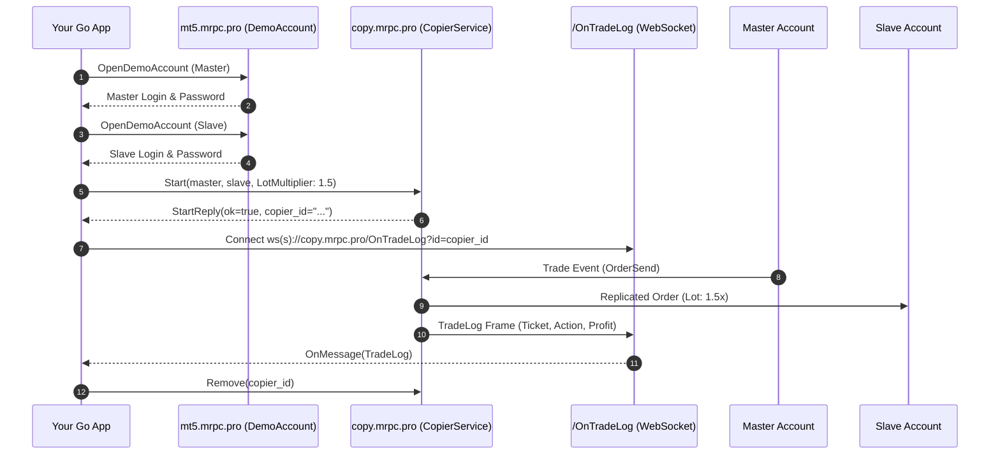

# Quick Start: Your First Project in 10 Minutes

This step-by-step tutorial walks you through building a complete trade replication application in **Go** from scratch using **GoCopier**.

---

## 1. Overview of Steps

In this guide you will:
1. **Provision two demo MetaTrader accounts** via gRPC (`DemoAccount.OpenDemoAccount`).
2. **Connect to MetaRPC Trade Copier** over HTTP/2 gRPC (`copy.mrpc.pro:443`).
3. **Start an active copier** configured with risk multipliers and SL/TP synchronization.
4. **List all registered copiers** and inspect their state.
5. **Stream real-time trade logs** via WebSocket (`/OnTradeLog?id={copierId}`).
6. **Pause and remove** the copier cleanly.

---

## 2. Complete Runnable Code

```go
package main

import (
	"context"
	"fmt"
	"log"
	"time"

	"github.com/MetaRPC/GoCopier/copier"
)

func main() {
	ctx := context.Background()

	// 1. Provision Demo Accounts via gRPC
	demoClient, _ := copier.NewDemoAccountClient("mt5.mrpc.pro:443")
	master, _ := demoClient.OpenDemoAccount(ctx, &copier.GuiDemoOpenAccountRequest{
		Company:   "MetaQuotes-Demo",
		FirstName: "Master",
		LastName:  "Trader",
		Email:     "master@example.com",
		Server:    "MetaQuotes-Demo",
	})
	slave, _ := demoClient.OpenDemoAccount(ctx, &copier.GuiDemoOpenAccountRequest{
		Company:   "MetaQuotes-Demo",
		FirstName: "Slave",
		LastName:  "Follower",
		Email:     "slave@example.com",
		Server:    "MetaQuotes-Demo",
	})
	fmt.Printf("Master: %d, Slave: %d\n", master.Login, slave.Login)

	// 2. Connect to Copier Service
	client, err := copier.NewCopierService("copy.mrpc.pro:443", "YOUR_USER_KEY", "")
	if err != nil {
		log.Fatalf("Failed to connect: %v", err)
	}
	defer client.Close()

	// 3. Start Copier
	reply, err := client.Start(ctx, &copier.StartRequest{
		UserKey:    "YOUR_USER_KEY",
		Master:     &copier.Account{Type: "MT5", User: master.Login, Password: master.Password, Server: master.Server},
		Slave:      &copier.Account{Type: "MT5", User: slave.Login, Password: slave.Password, Server: slave.Server},
		RiskType:   "LotMultiplier",
		RiskValue:  "1.5",
		CopySl:     true,
		CopyTp:     true,
	})
	if err != nil || !reply.Ok {
		log.Fatalf("Start failed: %v", reply.Error)
	}
	fmt.Printf("Started Copier ID: %s\n", reply.CopierId)

	// 4. List Copiers
	list, _ := client.List(ctx)
	for _, c := range list.Copiers {
		fmt.Printf("Copier: %s Master: %d Slave: %d\n", c.Id, c.MasterUser, c.SlaveUser)
	}

	// 5. Cleanup
	time.Sleep(2 * time.Second)
	client.Pause(ctx, reply.CopierId, true)
	client.Remove(ctx, reply.CopierId)
}
```

---

## 3. How It Works Under the Hood


